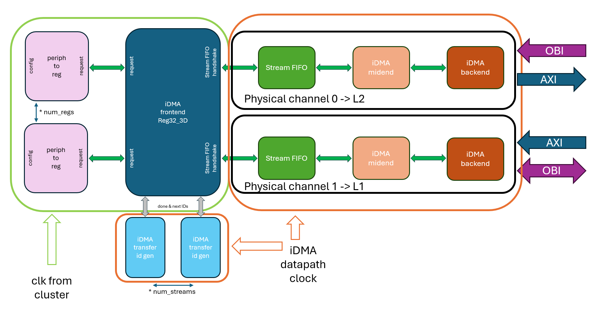
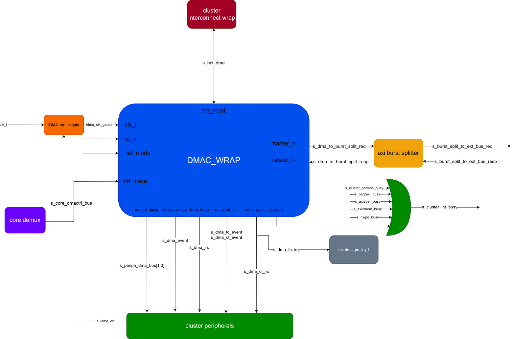
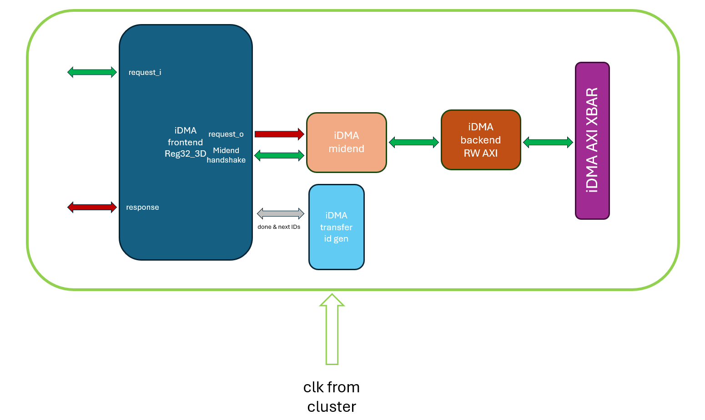

# iDMA Architecture

## 32-bits Frontend

### Insert top architecture scheme here

## Clock Gating Strategy

Two levels of clock gating are put in place (at RTL level):

- First level: one clock gating cell is placed at the cluster top level. This one is controlled by the cluster control unit, so that it can be configured via sw. This cell can completely shut down the iDMA clock, thus achieving the minimum power consumption when in idle.
- Second level: a second clock gating cell is placed at the top level of the iDMA wrapper. This cell is hw-controlled and provides the clock signal to the datapath portion of the iDMA. With this approach we're able to keep the DMA reactive to incoming transfer requests, while keeping off the datapath when not needed.

Refer to the schemes below:

The clock gating cell at cluster level is controlled by the iDMA sw drivers. This means that the programmer must make sure the clock is enabled before commencing a transfer.

## 32-bits Frontend in Security island

