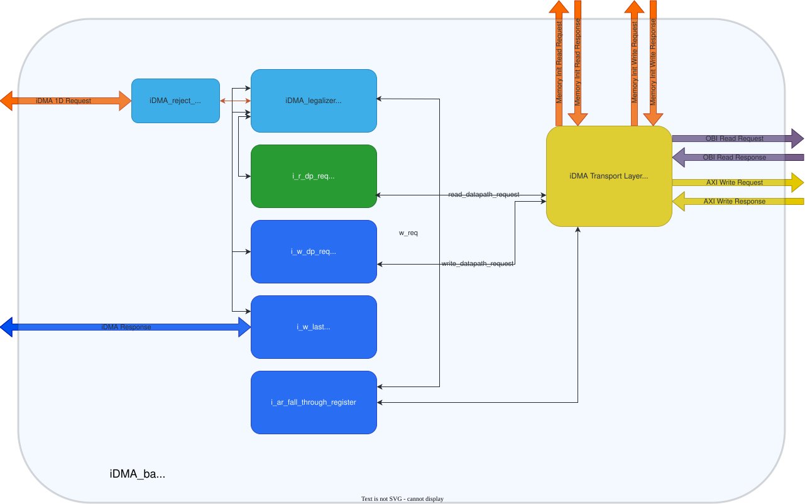
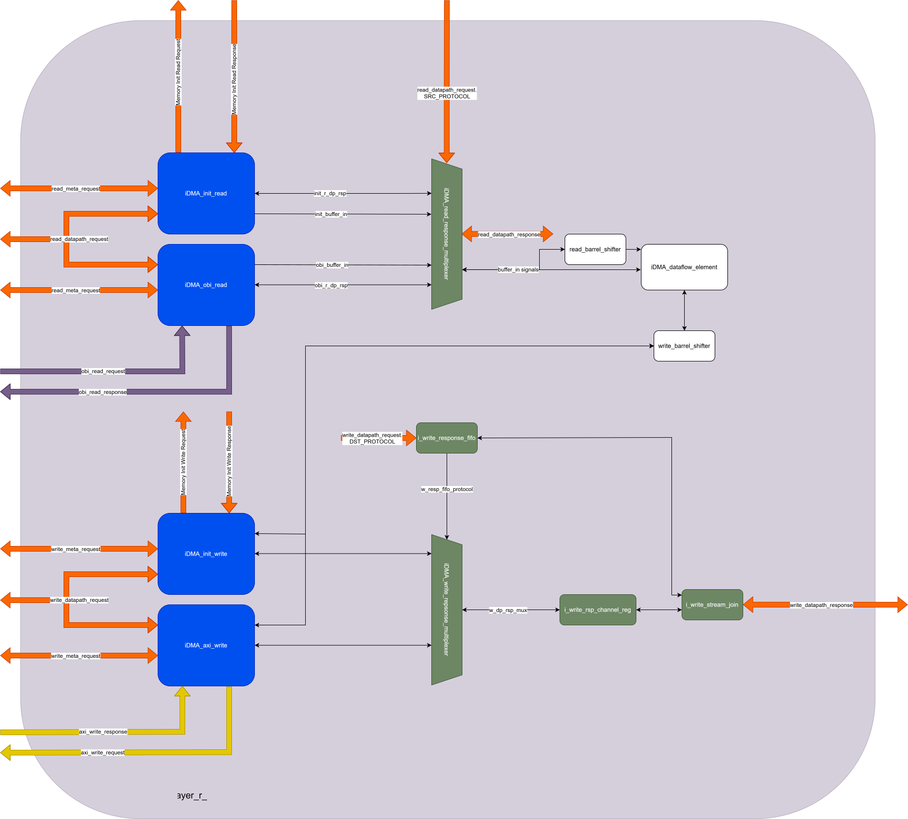
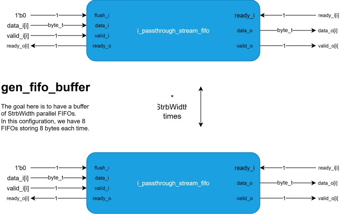
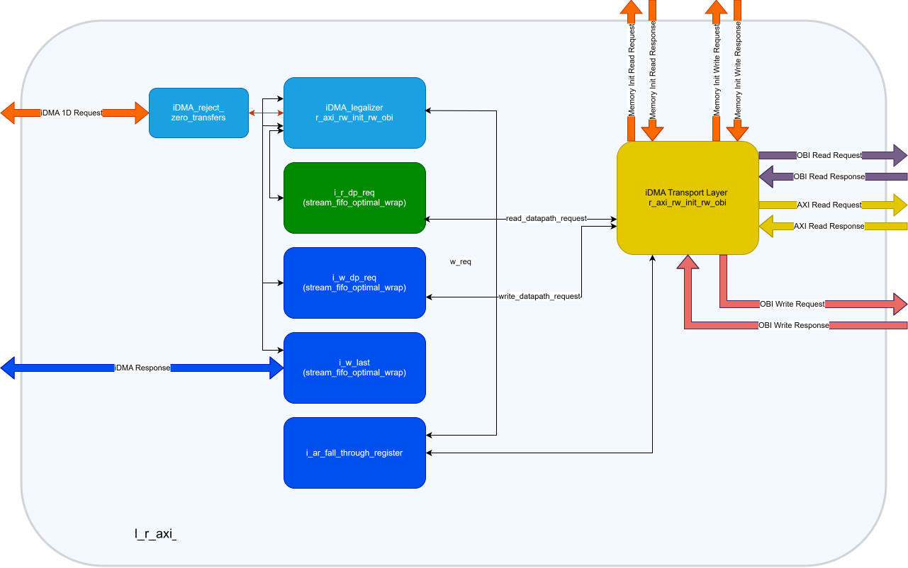
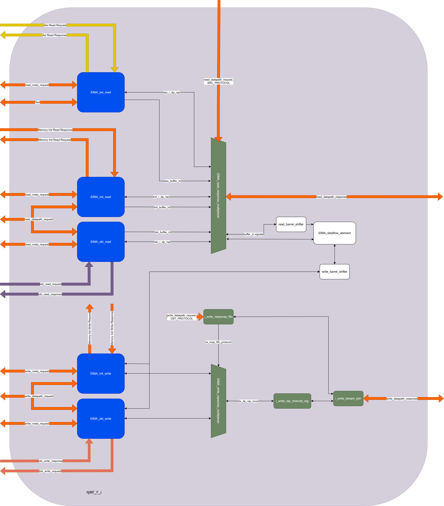

# iDMA BACKEND

This part of the iDMA is responsible for executing 1D transfers.
In the current pulp cluster implementation there are two physical channels:

- One supporting transfers towards L2: *idma_backend_r_obi_rw_init_w_axi*
    - In this case OBI is used as source protocol while AXI as destination protocol.
- The other supporting transfers towards L1: *idma_backend_r_axi_rw_init_rw_obi*
    - In this case AXI is used as source protocol while OBI as destination protocol.

So, the source and destination protocols that are being configured differ from one case to the other.

### Backend for transfers towards L2

Scheme:

Transportation Layer scheme:

## Description

Since we're transferring data towards L2, the following is true:

- We'll use the OBI protocol to read data from L1
- We'll use the AXI protocol to write data to L2

Data coming from the *idma_obi_read_module* is sent to the *iDMA_dataflow_element* module, which is just a buffer of StrbWidth parallel FIFOs to keep the data.

From the dataflow element, the data is then sent to the iDMA_axi_write module, where the write request for the AXI protocol is created.
#### Note: bursting is supported (by default at 256 bits)

Then the write request is sent back to the top of the iDMA wrapper to be connected to the *axi_rw_stream_join* module.

### Backend for transfers towards L1

Scheme:

Transportation Layer scheme:

## Description

The situation is very similar to the L1 -> L2 case. The communication protocols are switched now:

- We'll use the AXI protocol to read data from L2
- We'll use the OBI protocol to write data to L1

The structure of the iDMA dataflow element does not change with respect to the previous case. Data coming from the *iDMA_axi_read* module is sent to the dataflow element, where it passes through the FIFO buffer. Then, it's sent to the *iDMA_obi_write* module for creating the OBI write request, which is sent to the top of the iDMA wrapper.
There, it gets handled by the *OBI_rready_converter* before going into the *mem_to_banks_write* module, where it gets dispatched on two tcdm_master ports (with a 32-bits data width).
