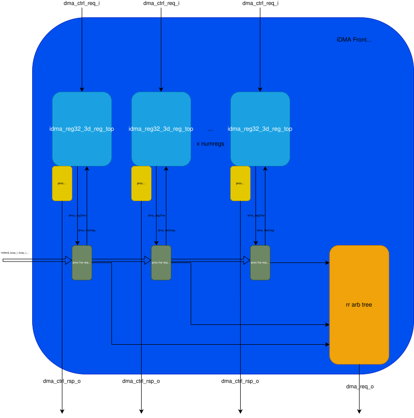
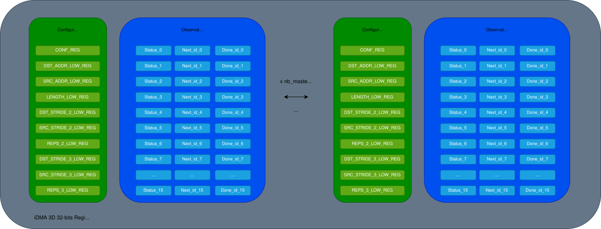

# iDMA FRONTEND

Structured as follows:

- Register sets
- Some binding logic for requests from the register set to the rest of the iDMA and viceversa
- Round Robin arbiter tree to correctly dispatch the transfers to the required channels



## iDMA Register Top

The register set for iDMA is structured as follows:


So, for each master of the iDMA (generally 8 cores + 2 PE), the following are available:

- Configuration registers:
    - These include all the transfer parameters + protocols
- Observational registers:
    - For each physical channel of the iDMA (so 2 in the current iDMA instantiation inside the pulp cluster), a triplet of observational registers is made available. These are necessary for synchronization, arbitrating the transfers and waiting on them.

Register widths:

- CONF_REG: 18-bits wide
- Transfer parameters registers: 32-bits wide
- Observational registers: 10-bits wide

## Registers

| Register              | Offset    | Bitwidth  | Fields                                                        |
| --------              |-------    | -------   | -------                                                       |
| CONF_REG              |           |   18      | Decouple options, reduce max len options, protocol options    |
| DST_ADDR_LOW_REG      |           |   32      | Starting address at the destination memory region             |
| SRC_ADDR_LOW_REG      |           |   32      | Starting address at the source memory region                  |
| LENGTH_LOW_REG        |           |   32      | Length parameter of the transfer                              |
| DST_STRIDE_2_LOW_REG  |           |   32      | 2D stride parameter at the destination memory region          |
| SRC_STRIDE_2_LOW_REG  |           |   32      | 2D stride parameter at the source memory region               |
| REPS_2_LOW_REG        |           |   32      | 2D repetitions parameter                                      |
| DST_STRIDE_3_LOW_REG  |           |   32      | 3D stride parameter the destination memory region             |
| SRC_STRIDE_3_LOW_REG  |           |   32      | 3D stride parameter the source memorey region                 |
| REPS_3_LOW_REG        |           |   32      | 3D repetitions parameter                                      |
| STATUS_0_REG          |           |   10      | Status register on the stream 0 channel                       |
| STATUS_1_REG          |           |   10      | Status register on the stream 1                               |
| NEXT_ID_0_REG         |           |   31      | Next ID register on the stream 0                              |
| NEXT_ID_1_REG         |           |   31      | Next ID register on the stream 1                              |
| DONE_ID_0_REG         |           |   31      | Done ID register on the stream 0                              |
| DONE_ID_1_REG         |           |   31      | Done ID register on the stream 1                              |

## Current configurations

In the pulp-sdk and pulp-runtime sw stacks we're configuring the iDMA as follows:

```

#define IDMA_DEFAULT_CONFIG 0x0
#define IDMA_DEFAULT_CONFIG_L1TOL2 (IDMA_DEFAULT_CONFIG | (IDMA_PROT_OBI << IDMA_REG32_3D_CONF_SRC_PROTOCOL_OFFSET) | (IDMA_PROT_AXI << IDMA_REG32_3D_CONF_DST_PROTOCOL_OFFSET))
#define IDMA_DEFAULT_CONFIG_L2TOL1 (IDMA_DEFAULT_CONFIG | (IDMA_PROT_AXI << IDMA_REG32_3D_CONF_SRC_PROTOCOL_OFFSET) | (IDMA_PROT_OBI << IDMA_REG32_3D_CONF_DST_PROTOCOL_OFFSET))
#define IDMA_DEFAULT_CONFIG_L1TOL1 (IDMA_DEFAULT_CONFIG | (IDMA_PROT_OBI << IDMA_REG32_3D_CONF_SRC_PROTOCOL_OFFSET) | (IDMA_PROT_OBI << IDMA_REG32_3D_CONF_DST_PROTOCOL_OFFSET))

#define IDMA_DEFAULT_CONFIG_2D 0x400
#define IDMA_DEFAULT_CONFIG_L1TOL2_2D (IDMA_DEFAULT_CONFIG_2D | (IDMA_PROT_OBI << IDMA_REG32_3D_CONF_SRC_PROTOCOL_OFFSET) | (IDMA_PROT_AXI << IDMA_REG32_3D_CONF_DST_PROTOCOL_OFFSET))
#define IDMA_DEFAULT_CONFIG_L2TOL1_2D (IDMA_DEFAULT_CONFIG_2D | (IDMA_PROT_AXI << IDMA_REG32_3D_CONF_SRC_PROTOCOL_OFFSET) | (IDMA_PROT_OBI << IDMA_REG32_3D_CONF_DST_PROTOCOL_OFFSET))
#define IDMA_DEFAULT_CONFIG_L1TOL1_2D (IDMA_DEFAULT_CONFIG_2D | (IDMA_PROT_OBI << IDMA_REG32_3D_CONF_SRC_PROTOCOL_OFFSET) | (IDMA_PROT_OBI << IDMA_REG32_3D_CONF_DST_PROTOCOL_OFFSET))

#define IDMA_DEFAULT_CONFIG_3D 0x800
#define IDMA_DEFAULT_CONFIG_L1TOL2_3D (IDMA_DEFAULT_CONFIG_3D | (IDMA_PROT_OBI << IDMA_REG32_3D_CONF_SRC_PROTOCOL_OFFSET) | (IDMA_PROT_AXI << IDMA_REG32_3D_CONF_DST_PROTOCOL_OFFSET))
#define IDMA_DEFAULT_CONFIG_L2TOL1_3D (IDMA_DEFAULT_CONFIG_3D | (IDMA_PROT_AXI << IDMA_REG32_3D_CONF_SRC_PROTOCOL_OFFSET) | (IDMA_PROT_OBI << IDMA_REG32_3D_CONF_DST_PROTOCOL_OFFSET))
#define IDMA_DEFAULT_CONFIG_L1TOL1_3D (IDMA_DEFAULT_CONFIG_3D | (IDMA_PROT_OBI << IDMA_REG32_3D_CONF_SRC_PROTOCOL_OFFSET) | (IDMA_PROT_OBI << IDMA_REG32_3D_CONF_DST_PROTOCOL_OFFSET))

```