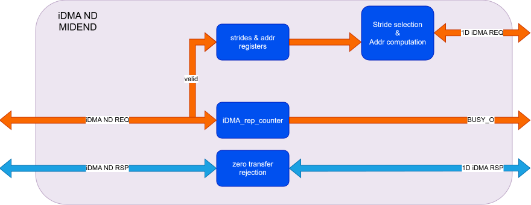

# iDMA MIDEND

This part of the iDMA is responsible for handling multi-dimensional transfers:
- The multi-dimensional transfers are split into 1-dimensional transfers and then sent to the backend for execution.

An iDMA midend module is instantiated for each bidirectional stream.

## Note:
This portion of the iDMA is gated by the rtl-controlled clock gating cell inside the iDMA wrapper, meaning it's clocked only when actually needed for a transfer along the specified direction.

## Insert scheme here

