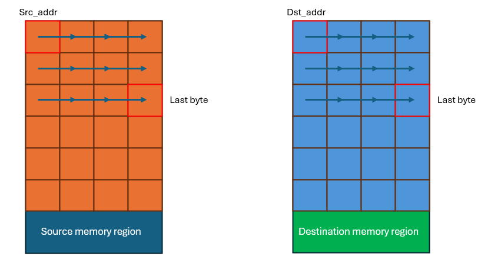
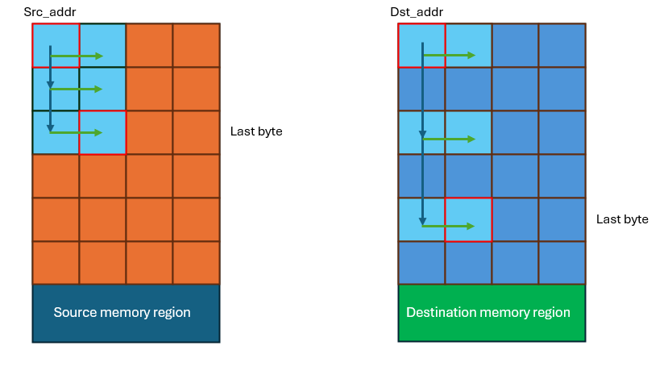
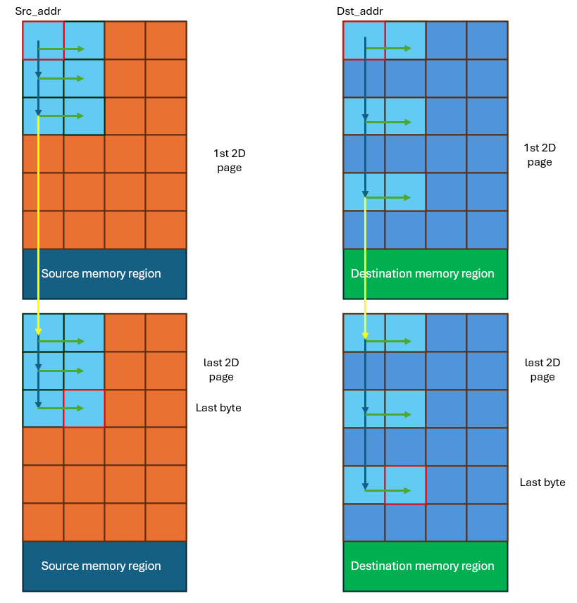

# Software stacks

Currently, iDMA simulation is supported both in the pulp-sdk and the pulp-runtime. Besides minimal differences, the main supported features are:

- Supported directions: L1->L2, L1->L2, L1-L1
- On each direction, transfers up to 3 dimensions and 64 kByte of total size can be configured.
- Both individual wait and barrier functions based on the transfer direction are supported.

On both sw stacks, the following testcases are supported:

- Transfer dimensions: 1D, 2D and 3D.
- Multi-core modes: all 8 cores can program the iDMA. Depending on whether MULTI_CORE_S or MULTI_CORE_P is enabled, this happens in a serial or parallel way.
- All transfer directions are tested.
- Stimuli for each transfer are generated through python scripts, meaning:
  - 1D Transfers: size, src_addr, dst_addr
  - 2D Transfers: size, src_addr, dst_addr, src_stride, dst_stride
  - 3D Transfers: size, src_addr, dst_addr, src_stride, dst_stride, src_stride_3d, dst_stride_3d, number of 3d repetitions

**TODO**: allow for burst length configurability directly from the drivers.

iDMA tests in regression tests repository: https://github.com/FondazioneChipsIT/regression_tests/tree/new_iDMA_tests/idma_tests

Inside the regression tests folder there is also a benchmark test, that's being used for power evaluations. This test allows three modes:

    - TX: allows to enqueue up to 8 transfers towards L2
    - RX: allows to enqueue up to 8 transfers towards L1
    - TX_RX: allows to enqueue up to 8 transfers for each direction and executes them 2-by-2 in parallel.
    - IDLE: the iDMA does nothing and a transfer is executed by Core 0.

iDMA tests in pulp-sdk repository: https://github.com/FondazioneChipsIT/pulp-sdk/tree/chips-it/tests/idma

## Example code

The basic call to iDMA to execute a 1D transfer looks like this:

```
# Enable the iDMA frontend clock (so that we're able to configure it)
    plp_idma_enable_clk();
# Configure and launch the transfer
    plp_cl_dma_wait_toL2(pulp_cl_idma_L1ToL2((unsigned int) src_ptr, (unsigned int) dst_ptr, size));
# Disable the iDMA frontend clock once the transfer has completed
    plp_idma_disable_clk();
```

In this case an individual wait has been used for blocking the execution until the transfer is finished, but also direction-based barrier functions are provided. Usage as follows:

```
# Enable the iDMA frontend clock (so that we're able to configure it)
    plp_idma_enable_clk();
# Configure and launch the transfer
    pulp_cl_idma_L1ToL2((unsigned int) src_ptr, (unsigned int) dst_ptr, size);
#Barrier: blocks the execution until all transfers towards L2 are completed.
    plp_cl_dma_barrier_toL2();
# Disable the iDMA frontend clock once the transfer has completed
    plp_idma_disable_clk();
```

## Protocol configuration

The iDMA instance inside pulp cluster currently supports three transfer directions:

- L1 -> L2
  - This is done on the stream 0 and by configurting the following protocols:
    - Source protocol: OBI
    - Destination protocol: AXI
- L2 -> L1
  - This is done on the stream 1 and by configuring the following protocols:
    - Source protocol: AXI
    - Destination protocol: OBI
- L1 -> L1
  - This is done on the stream 1 and by configuring the following protocols:
    - Source protocol: OBI
    - Destination protocol OBI

Protcol configuration is transparent to the user, who needs just to specify the intended direction of the transfer.
From an HW perspective, this means having two separate physical channels, which instantiate different backend modules:

- **COPY_IN CHANNEL**:
  - This channel makes use of the *idma_backend_r_obi_rw_init_w_axi* module, which indeeds allow read operations through OBI and write opoerations through AXI.
- **COPY_OUT CHANNEL**:
  - This channel makes use of the *idma_backend_r_axi_rw_init_rw_obi* module, which indeeds allow read operations both through AXI and OBI and write operations through OBI.

  The protocol configuration is done in the drivers through default configurations, as follows:

  ```C
    #define IDMA_DEFAULT_CONFIG 0x0
    #define IDMA_DEFAULT_CONFIG_L1TOL2 (IDMA_DEFAULT_CONFIG | (IDMA_PROT_OBI << IDMA_REG32_3D_CONF_SRC_PROTOCOL_OFFSET) | (IDMA_PROT_AXI << IDMA_REG32_3D_CONF_DST_PROTOCOL_OFFSET))
    #define IDMA_DEFAULT_CONFIG_L2TOL1 (IDMA_DEFAULT_CONFIG | (IDMA_PROT_AXI << IDMA_REG32_3D_CONF_SRC_PROTOCOL_OFFSET) | (IDMA_PROT_OBI << IDMA_REG32_3D_CONF_DST_PROTOCOL_OFFSET))
    #define IDMA_DEFAULT_CONFIG_L1TOL1 (IDMA_DEFAULT_CONFIG | (IDMA_PROT_OBI << IDMA_REG32_3D_CONF_SRC_PROTOCOL_OFFSET) | (IDMA_PROT_OBI << IDMA_REG32_3D_CONF_DST_PROTOCOL_OFFSET))

    #define IDMA_DEFAULT_CONFIG_2D 0x400
    #define IDMA_DEFAULT_CONFIG_L1TOL2_2D (IDMA_DEFAULT_CONFIG_2D | (IDMA_PROT_OBI << IDMA_REG32_3D_CONF_SRC_PROTOCOL_OFFSET) | (IDMA_PROT_AXI << IDMA_REG32_3D_CONF_DST_PROTOCOL_OFFSET))
    #define IDMA_DEFAULT_CONFIG_L2TOL1_2D (IDMA_DEFAULT_CONFIG_2D | (IDMA_PROT_AXI << IDMA_REG32_3D_CONF_SRC_PROTOCOL_OFFSET) | (IDMA_PROT_OBI << IDMA_REG32_3D_CONF_DST_PROTOCOL_OFFSET))
    #define IDMA_DEFAULT_CONFIG_L1TOL1_2D (IDMA_DEFAULT_CONFIG_2D | (IDMA_PROT_OBI << IDMA_REG32_3D_CONF_SRC_PROTOCOL_OFFSET) | (IDMA_PROT_OBI << IDMA_REG32_3D_CONF_DST_PROTOCOL_OFFSET))

    #define IDMA_DEFAULT_CONFIG_3D 0x800
    #define IDMA_DEFAULT_CONFIG_L1TOL2_3D (IDMA_DEFAULT_CONFIG_3D | (IDMA_PROT_OBI << IDMA_REG32_3D_CONF_SRC_PROTOCOL_OFFSET) | (IDMA_PROT_AXI << IDMA_REG32_3D_CONF_DST_PROTOCOL_OFFSET))
    #define IDMA_DEFAULT_CONFIG_L2TOL1_3D (IDMA_DEFAULT_CONFIG_3D | (IDMA_PROT_AXI << IDMA_REG32_3D_CONF_SRC_PROTOCOL_OFFSET) | (IDMA_PROT_OBI << IDMA_REG32_3D_CONF_DST_PROTOCOL_OFFSET))
    #define IDMA_DEFAULT_CONFIG_L1TOL1_3D (IDMA_DEFAULT_CONFIG_3D | (IDMA_PROT_OBI << IDMA_REG32_3D_CONF_SRC_PROTOCOL_OFFSET) | (IDMA_PROT_OBI << IDMA_REG32_3D_CONF_DST_PROTOCOL_OFFSET))
  ```

  These default configurations are automatically set into the iDMA registers when the API for the specified transfer direction is called.

## Transfer Examples

A one-dimensional transfer is pretty simple in terms of parameters that need to be specified:

- **src_addr**: this is the starting address in the source memory region
- **dst_addr**: this is the starting address in the destination memory region
- **size**: this is the size of the transfer in bytes (maximum supported: 65536)



As shown in the above image, bytes are accessed contiguously in both memory regions. So, the 1D transfer can be seen as a 2D transfer where both strides and length are set to 1.

When executing 2D transfers:

- **src_stride**: distance in bytes to jump to the next series of consecutive data in the source region
- **dst_stride**: distance in bytes to jump to the next series of consecutive data in the destination region
- **length**: number of consecutive bytes to be transferred before the next stride
- **num_reps**: transfer size divided by the length, so how many consecutive transfers are to be executed

An obvious requirement is for the length to be less than the strides, in order to avoid overwriting data in the destination region.



As shown in the above image, having a length greater than the stride would mean overwriting data when jumping.
In this case, we have:

- **src_stride**=4
- **dst_stride**=8
- **length**=2

When executing 3D transfers, the following need to be defined in addition to the previous parameters:

- **src_stride_3d**: this stride is the jump in bytes between two 2D "pages" in the source region of the transfer
- **dst_stride_3d**: this stride is the jump in bytes between two 2D "pages" in the destination region of the transfer
- **num_reps_3d**: this is the number of 2D transfers that make up the three-dimensional transfer



As shown in the above image, the 3D transfer is composed of several (nmm_reps_3d) 2D transfers. The yellow arrows represent the 3D strides.
In this case we have:

- **src_stride**=4
- **dst_stride**=8
- **length**=2
- **src_stride_3d**=16
- **dst_stride_3d**=8

Also, notice that strides (both 2D and 3D) can be different between the source and the destination memory regions.

## Deeploy support

iDMA is partially supported inside Deeploy as well (only 1D transfers for now). Can be found here: https://github.com/FondazioneChipsIT/Deeploy/commits/chips-it/

At the moment, only simulation on the pulp-open + iDMA rtl platform is supported (gvsoc model needs to be updated).

At the moment, iDMA is supported in Deeploy. The following features are tested:

- 1D/2D transfers
- clock gating control

### Note

- In Deeploy the pulp-sdk drivers for iDMA are used.